# User Experience Design

## App Map

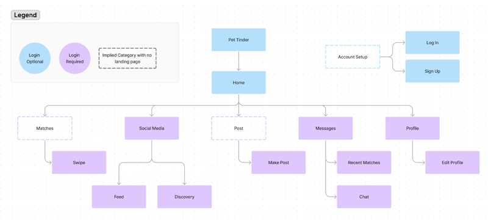

## Wireframes

### Login
-Login page that allows users to register if they are new 

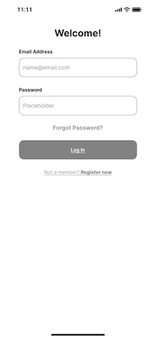

### Sign Up
-Account creation page 

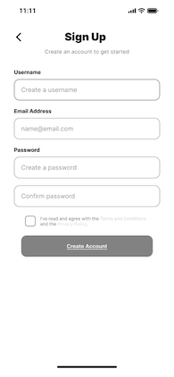

### Swipe
-Short profile of others that user matches with, allowing the user to choose whether to "swipe right" 

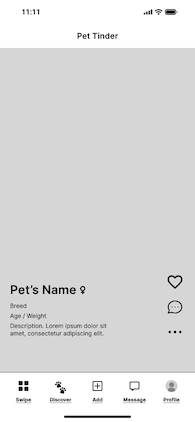

### Feed
-Social media feed of posts and photos from users you are friends with

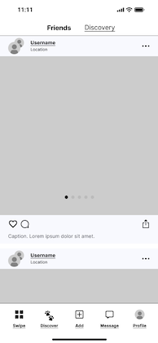

### Discovery
-Social media feed of public users near you/suggested

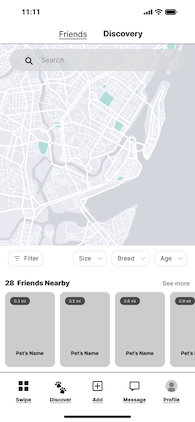

### Create Post
-Create post page with options to add photos, caption, and location

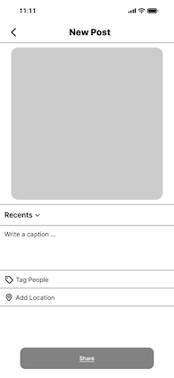

### Messages
-Messages tab showing all messages with other users

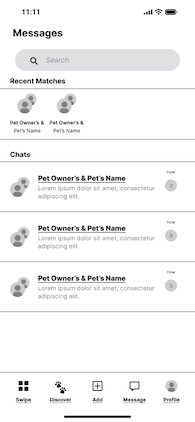

### Chat
-A chat box between two users

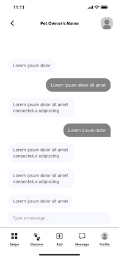

### Alternative Chat
-Sending locations feature in chat

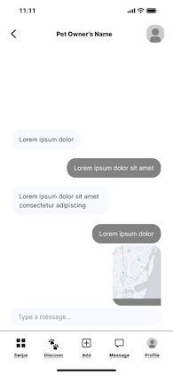

### Profile
-User profile 

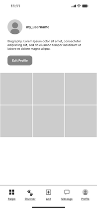

### Edit Profile
-Options to edit the profile 

### Example User
-The profile of another user

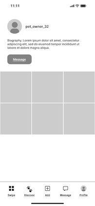

## Clickable Prototype

[click here](https://www.figma.com/proto/2Y7J5FMnxS5PYc7yzeosI7/Pet-Tinder?page-id=0%3A1&type=design&node-id=2-37&viewport=587%2C-334%2C0.57&t=BTeEVRLgcnJk5adS-1&scaling=scale-down&starting-point-node-id=2%3A37&mode=design)